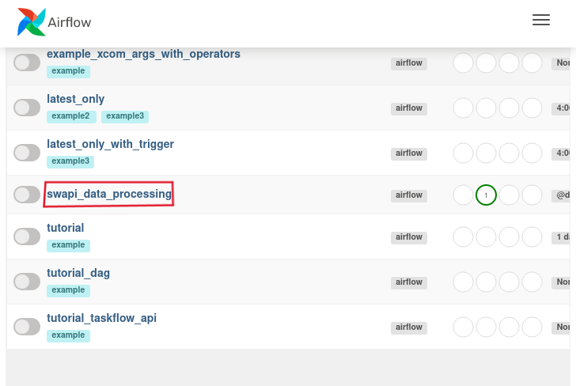
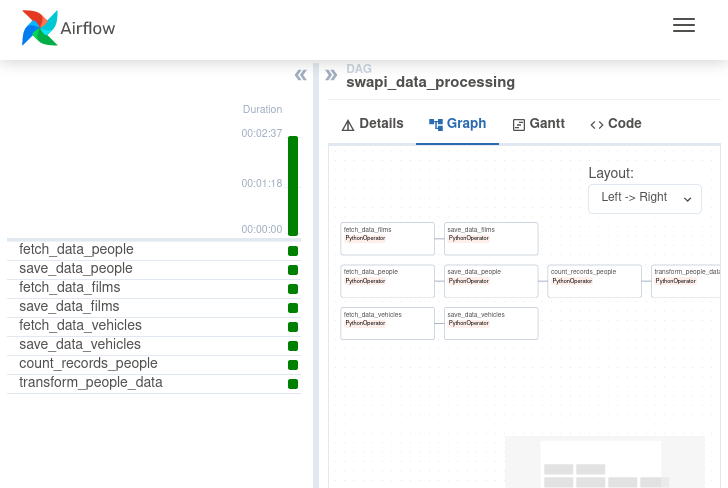

# Processamentos de Dados da SWAPI com Apache Airflow (Máquina Virtual Linux)
## Contextualização
### Visão geral
Este repositório contém scripts para extrair dados da API Star Wars (SWAPI) e transformá-los para atender às necessidades da equipe de Produtos para o lançamento de um novo filme de ficção científica, utilizando o Airflow para automatizar o processo.

### Detalhamento
- Parte 1: extrai os dados da API do Star Wars no 
endpoint **people**, **films** e **vehicles** e armazene o retorno da API de todas as paginações 
localmente em arquivos no formato .json. Salva os arquivos baseado em uma estrutura de 
diretórios de acordo com o ano contido no conteúdo da propriedade created. 

- Parte 2: retorna número de registros retornados do enpoint **people**, e tendo uma lista dos filmes veiculados com cada registro de **people** salva um arquivo .json o nome da pessoa e uma lista de títulos dos filmes 
vinculados aos registros de **people**.

## Pré requisitos
- VirtualBox instalado              - https://www.virtualbox.org/wiki/Downloads
- Servidor virtual baixado            - https://drive.google.com/file/d/1FhxstwtrRLS84klppFG_MA8X__D0R3Ln/view?usp=drive_link
- Dados para login no servidor virtual:
    - Usuário: yasmin
    - Senha: datalab

## Terminal
```
cd Documents/airflowblu
```
```
source venv/bin/activate
```
```
export AIRFLOW_HOME=~/Documents/airflowblu
```
```
airflow standalone
```
## Acessando a interface web do Airflow pelo Firefox
- url: http://localhost:8080
- username: admin
- password:  553hxcSk8BecWHK9

## Executando a dag
Localize a dag com nome "swapi_data_processsing", selecione-a para um nível maior de detalhmento.
<p align="center"></p>

Subsequentemente, ative o botão toggle de DAG e também de Autorefresh. Agora é só aguardar a execução das tasks que quando executadas com sucesso ficam com verde escuro.

<p align="center"></p>
